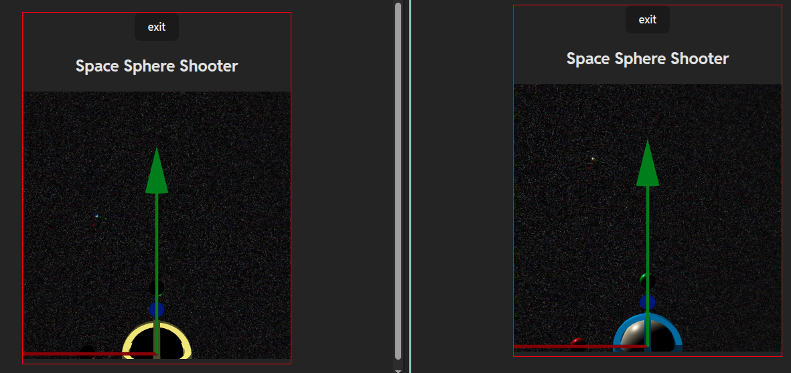

# SPACE SPHERE SHOOTER
Multiplayer online browser game. TypeScript client. TypeScript server.

  

## Play online for free 

[https://space-sphere-shooter.onrender.com](https://space-sphere-shooter.onrender.com)

Demo deployment implemented as two separated dockerized web services onrender.com.

 

## Development environment

- install [Bun](https://bun.sh) runtime.
- install [nvm](https://github.com/nvm-sh/nvm) (to manage node versions), or just install [node](https://nodejs.org/en).
- clone the repository using vscode.
- open terminal in **repo root level**(this README.md file folder).
- development and build command sequences started from the **repo root level**.
- **the vpn extension of the browser can raise CORS issues in case of local development**.
- the client and the server are separated, and executed using the same command, but **from different folders**.
- **do not touch without reasons the babylonjs quaternions(issues reported)**
- the file **bun/src/manage/open.ts** includes the `if(!DEVLOG){...}` code fragment, responsible to prohibit many clients on one IP (two tabs in browser etc). The `DEVLOG=false` activates this functionality and makes development on one machine more complicated. So before turn off all devlog prints, be ready to difficulties of check/test/development. 

Project development runtime version `bun -v` upgraded to version **1.3.13**

## Development run

### Server
- terminal: `cd bun`
- terminal: `bun i`
- terminal: `bun run dev`

### Client
- terminal: `cd vite/ts`
- terminal: `bun i`
- terminal: `bun run dev`

## Build

Standalone build and Dockerfile build available.

In case of onrender.com deployment, for a client configuration, the `PORT` variable from `.env` file must be removed(not added), otherwise the web service deployment will stuck for long time to check the `PORT` value is functional, then crush. 

## Dockerfile development build

[Docker](https://www.docker.com) environment must be installed, configured and run.

### Server

- terminal: `cd bun`
- terminal: `./devrun.sh`

### Client

- terminal: `./devrun.sh`

## Dockerfile deployment build

[Docker](https://www.docker.com) environment must be installed, configured and run.

### Server

- terminal: `cd bun`
- terminal: `./run.sh`

### Client

- terminal: `./run.sh`

## Standalone build

### Server

- terminal: `cd bun`
- terminal: `bun i --no-cache`
- terminal: `bun build --env-file=./.env --minify ./src/index.ts --outdir ./out --target=bun --env=inline`
- **out** folder created.
- (optional) terminal: `bun run out/index.js` to check(run) the build.

### Client

- terminal: `cd vite/ts`
- terminal: `bun i`
- terminal: `bun run build`
- **dist** folder created.
- (optional) terminal: `bun add serve` to install local test server.
- (optional) terminal: `bun run serve -s dist` to check(run) the build.

## Structure

- separated client and server.
- development run from separated terminals.
- the same **.env** file used to configure both client and server.
- **.env** placed in "bun" folder of the repo.
- **.env** has no unsafe/secret info.

**SERVER**:
- [Bun.sh](https://bun.sh) runtime based server .
- - Dockerfile.
- - everywhere uses ws connection, except home page buttons (use https).
- - - **Download assets** - for future needs, to download heave assets before join.
- - - **Check Connection** - check the client not banned (at the moment no alert if server is dead, but naturally visible in console).
- - - **Connect to WebSocket** - establish ws connection to server.
- - **everything in ram**(no db used).
- - **nickname duplication** is possible.
- - **temporary ban** by ip (hardcoded for one hour), in case of signs of hijacking.
- - **(wip)** CORS managing from .env file, for multiple client domains.

**CLIENT**:
- [Vite](https://vite.dev) + [TypeScript](https://www.typescriptlang.org) client([Jotai](https://jotai.org) as ws state manager, [Babylon](https://www.babylonjs.com) for 3D).
- - Dockerfile.
- - **critical error** - jump to home page, with closing connection
- - **(wip, minor)** compile to solid executable if possible using electrobun.dev or electron, to promote/distribute in Steam for free.

## Deployment/Details/Desirable futures

**SERVER**:
- consider turn on the prohibition of the mupticonnection from one IP.
- consider to restrict the access to the server, uses origin settings of the bun runtime server implementation.
- consider implemented collision uses 26 boxes around or through one axis coordinates filtering if it will be reasonable(at the moment, it is not).
- consider filter "invisible" lazer shot, from another side, it is bonus way.

**CLIENT**:
- consider implement even vs odd style, to separate fractions, visually.
- consider improve visuals/sounds, at the moment they are super raw.
- consider proper GUI, at the moment only raw hp indicator added.

